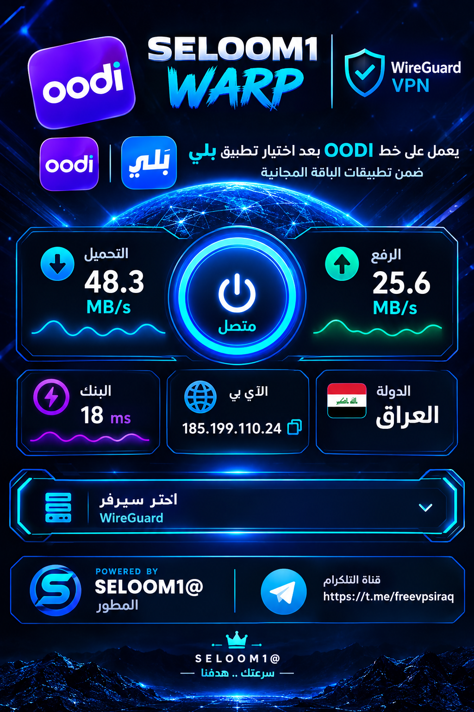

# Seloom VPN

تطبيق Android مفتوح المصدر للاتصال بخوادم **WireGuard** وفتح اتصال الإنترنت عبر نفق VPN. يحتوي التطبيق على واجهة عربية/إنجليزية بطابع cockpit، اختيار الخادم، عدادات التنزيل والرفع، قياس ping، عرض معلومات الشبكة، واستيراد روابط WireGuard.

## معاينة الواجهة



بطاقة حقوق المطور **SELOOM1@** ورابط قناة التلغرام الرسمية: [https://t.me/freevpsiraq](https://t.me/freevpsiraq)

## الميزات

- تشغيل وإيقاف نفق VPN باستخدام مكتبة WireGuard الرسمية لنظام Android.
- تمرير حركة الإنترنت كاملة عبر النفق (`0.0.0.0/0` و`::/0`) عندما يسمح إعداد الخادم بذلك.
- استيراد روابط `wireguard://` مع تنظيف المسافات والترميز غير الصحيح.
- حفظ الخوادم محليًا واختيار الخادم من الواجهة.
- عرض حالة الاتصال، السرعة التقريبية، ping، عنوان IP ومعلومات الشبكة.
- واجهة مبنية باستخدام Kotlin وJetpack Compose وMaterial 3.

### قائمة التطبيقات (Blacklist)

- اختيار تطبيقات محددة لاستثنائها من نفق VPN، بحيث تستخدم الإنترنت العادي.
- البحث عن التطبيقات بالاسم أو اسم الحزمة.
- عرض أيقونة التطبيق واسمه واسم الحزمة داخل القائمة.
- إظهار أو إخفاء تطبيقات النظام باستخدام مفتاح مستقل، مع إخفائها افتراضيًا لتسهيل الاختيار.
- حفظ الاختيارات محليًا وتطبيقها مباشرة على اتصال WireGuard، مع إعادة تشغيل النفق تلقائيًا عند تغيير القائمة أثناء الاتصال.
- توضيح داخل التطبيق: **هنا تختار تطبيقات الباقة المجانية التي اخترتها حتى يبقى الإنترنت فيها ثابتًا والبنك ثابتًا.**

## الإصدار الحالي

**v1.1.3** — إصلاح إعادة تطبيق قائمة التطبيقات المستثناة عند تغييرها أثناء اتصال VPN، مع إضافة قائمة التطبيقات القابلة للبحث، أيقونات التطبيقات، التحكم بتطبيقات النظام، ودعم تطبيقات الباقة المجانية.

## المتطلبات للبناء للمطورين

- Android Studio حديث يدعم Gradle Wrapper المرفق.
- JDK 11 أو أحدث.
- جهاز أو محاكي Android بإصدار API 24 أو أحدث.
- إعداد WireGuard صالح من مزود VPN أو خادمك الخاص.

## البناء والتشغيل

1. استنسخ المستودع وافتحه في Android Studio:

   ```bash
   git clone https://github.com/seloom1/SeloomVPN.git
   cd SeloomVPN
   ```

2. شغّل اختبارات الوحدة:

   ```bash
   ./gradlew test
   ```

3. أنشئ نسخة Debug وثبّتها على جهاز Android:

   ```bash
   ./gradlew assembleDebug
   ```

   ستجد ملف APK في `app/build/outputs/apk/debug/`.

## إضافة إعداد WireGuard

من داخل التطبيق اختر إضافة/استيراد إعداد ثم الصق رابط `wireguard://` الذي يحتوي على مفتاحك الخاص وإعدادات الخادم. لا تشارك هذا الرابط علنًا؛ فهو قد يحتوي على **PrivateKey** يمنح صلاحية الاتصال. عند تشغيل VPN سيطلب Android إذن إنشاء اتصال VPN للمرة الأولى.

للتطوير، يمكن أيضًا تعديل مصدر الخوادم الافتراضية محليًا، لكن يجب عدم رفع أي مفتاح حقيقي إلى GitHub. يوصى باستخدام مدير أسرار أو ملف محلي مستبعد من Git.

## بنية المشروع

| المسار | الوصف |
| --- | --- |
| `app/src/main/java/com/example/vpn` | إدارة نفق WireGuard وتحليل الروابط |
| `app/src/main/java/com/example/ui` | شاشات Compose وViewModel |
| `app/src/main/java/com/example/ui/components` | مكونات الواجهة وقائمة Blacklist |
| `app/src/main/java/com/example/model/InstalledApp.kt` | نموذج التطبيق المثبت وتمييز تطبيقات النظام |
| `app/src/main/java/com/example/data` | التخزين المحلي للخوادم والتطبيقات المستثناة |
| `app/src/test` | اختبارات تحليل روابط WireGuard |

## الخصوصية والمسؤولية

التطبيق ينشئ نفق VPN على الجهاز، لذلك يعتمد مستوى الخصوصية والأمان على خادم WireGuard ومزود الخدمة الذي تستخدمه. راجع إعدادات DNS و`AllowedIPs` وسياسة الخصوصية الخاصة بمزود الخادم قبل الاستخدام. هذا المشروع لا يضمن تجاوز القيود أو توفر الإنترنت في كل شبكة.

## الترخيص

لم تتم إضافة ترخيص قانوني بعد. أضف ملف `LICENSE` قبل اعتبار المشروع مفتوح المصدر للاستخدام أو إعادة التوزيع.

## المطور

**Seloom1** — Seloom VPN  
قناة التلغرام والحقوق: [https://t.me/freevpsiraq](https://t.me/freevpsiraq)
